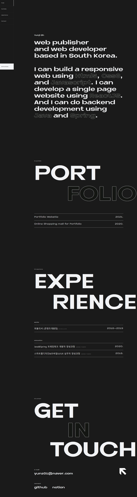

# 2021 portfolio website

## 01. 수행 프로젝트

- 프로젝트명
  > 2021 포트폴리오 웹사이트 구현
- 결과물 형태
  > 웹어플리케이션
- 수행기간
  > 2021.11.29 ~ 2021.12.07 (약 2주)
- 주요 언어
  > Html5
  > Css3
  > Javascript
  - 결과물
    > 호스팅 주소 : [github-website](https://dhdbswl.github.io/yunjiportfolio/) 
    > 소스코드 : [github](https://github.com/dhdbswl/yunjiportfolio.git)

---

## 02. 결과물 디테일

- 메인 페이지
  

- 포트폴리오 리스트 페이지
  
